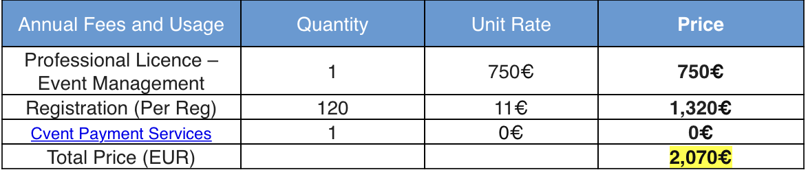

# Nederlandse Vlam Vereniging - NVV 

## Section 1: New NVV Website

Current version is at [NVV website](http://vlamvereniging.nl/en). This version was developed by [Kiwico](https://www.kiwico.nl/nvv). 

### Wishes in general 
Lean, modular, extensible and easily maintanable website
- only English (no Dutch) pages;
- refer to Linked-Inn for news items; 
- maintain list of news items on website as repository;
- merge NVV website and Combura website and allow payment of registration via IDEAL? 

How should webpages be structured (top down approach)?

### General Outline/Structure for new website  

#### Home page
What are NVV ambitions/goals/missions for NVV? Change current text into modern and easily accessable text with  broader/modern/timely scope 

Distinguish between simulation (numerical and analytical) and experimental work. 

Highlight breath andf depth of scope: industrial furnaces, gas turbines in aero, car/truck/ship engines, hydrogen,  synthetic fuels and more; 

Stress importance of public domain test cases, public domain data, public domain simulation tools (SU2, OpenFoam, Python, Julia)

#### Academic members 
current: TU Delft (aero (Rao Gangoli) and 3ME (Klein)), 
- [Power and Flow](https://www.tue.nl/en/research/research-groups/power-flow/), Department of Mechanical Engineering, TU Eindhoven (Bastiaans, De Goeij, van Ooijen)
- [Thermal Engineering](https://www.utwente.nl/en/et/tfe/research-groups/TE/), Department of Fluid and Thermal Enginreering, TU Twente (Kok)
- [Process and Energy Department](https://www.tudelft.nl/3me/over/afdelingen/process-energy), TU Delft (Klein, de Jong)
- [Fluid Performance and Propulsion](https://www.tudelft.nl/index.php?id=4544), TU Delft (Rao Gangoli)

other: ULB Brussels (Parente?), Louvain-la-Neuve, Mons (in the past), Namur, Liege, Leuven, Ghent (in the past)? 

#### Corporate Members 
current: Shell, Bosch,  Bekaert and De Jong. 

other (?): Celsian, Danieli-Corus, Albermarle, GAS Unie, DNVGL, KEMA (safety, hydrogen), TNO Prins Maurits Lab. 

#### Link to similar organizations 
Link to IFRF still up to date? 

### Infrastructure to Build New Website 
Ask for offers at e.g. [99designs](https://en.99designs.nl). 

## Section 2: NVV Finances (details go elsewhere)

- how much money is there? 

- income on yearly basis? 

- expenses on yearly basis?  

- how much is typically spend for Combura? 

- are other activities planned? 

### Expenses for Combura go here 

### Other Yearly Expenses 

- IFRF membership 

- MetalToPower: EUR 98.080 over four years.

- DYNAF 

### Yearly Income 

- membership from Bekaert (Raymond Westers and Marc Bus), Bosch and Shell;

## Section 3: Combura-2022 
- website [combura.nl](https://www.combura.nl)
- hosted by SciConf organisers (Gemma van der Windt and Marion de Boer and Phyros Stathis(website))
- alternatives (payment via IDEAL): [CVENT](cvent.org)
- dates: Wednesday 23 en Thursday 24 November 2022 

### Section 3.1: Online Registration 

<b>Info from EasyConference</b>: In the first instance, we will support you fully with the online registration. The cost for this service would be 20.00 euro per registration, (plus VAT, 19% in Cyprus, if this cannot be avoided as per EU regulations). The following services will be included:
 
·        Online registration for the conference.
·        Online support to participants and organisers
·        Financial management of registration fees; The system will be used so that we could receive all the payments on your behalf.
·        Invoicing for registration fees.
·        Crosscheck and management support of accepted abstracts and registrations.
·        Preparation of PDF files for name badges, certificates of attendance and invoices.
·        Production of any relevant lists that could be produced from the system based on the submitted information.
·        Optional use of the additional functionality of the system regarding accommodation, conference extras, etc.
 
Please note that in case that the funds will be cleared through our credit card clearing company and our bank accounts are used, there will be a cost for credit card/bank charges equivalent to 2.5%, (this cost would be incurred with any payment method you would choose and in most cases it is substantially higher).

### Section 3.2: First Call For Papers 

1. Finalize dates;
2. Finalize registration fee;
3. Finalize distribution list;
4. Send final version to Domenico of PDF document;  

### Contact List 

#### Hotel: Conferentiehotel Kontakt der Kontinenten 
- Annelies van de Ree Reservations department 
- Tel +31 (0)346 33 25 37, Direct +31(0)346 33 25 38
- Emma van Gool Reserveringen
- Tel +31 (0)346 33 25 37, Direct +31 (0)346 33 25 36
- Email: Reserveringen@kontaktderkontinenten.nl 
- Amersfoortsestraat 20, 3769 AS Soesterberg 
- [KontaktderKontinenten.nl](KontaktderKontinenten.nl)

#### Graphic Design Call for Papers: KIWICO  
- Quirrijn Schuur 
- De Savornin Lohmanstraat 11BS, 3551 BS Utrecht 
- Tel: +31 (0)6 4181 45 55 
- Email: qs@kiwico.nl 
- [Kiwico](www.kiwico.nl)

#### Website 
- Pyrrhos Stathis 
- Email: info@fyper.com

### Organizing comite members
- Harshit Gupta: 06.15.41.44.59
- Nijso Beishuizen: Bosch Thermotechniek, +31 570 60-2553, Nijso.Beishuizen@nl.bosch.com 
- Mark Senden: Mark Senden, 06.38.10.69.22, m.senden@dejong.nl
 
### Email List for First Call of Papers 

Academic 

r.j.m.bastiaans@tue.nl; francesco.contino@uclouvain.be; n.j.dam@tue.nl; Ward.DEPAEPE@umons.ac.be; A.GangoliRao@tudelft.nl; L.P.H.d.Goey@tue.nl;  S.Hickel@tudelft.nl; herve.jeanmart@uclouvain.be; S.A.Klein@tudelft.nl; j.b.w.kok@utwente.nl; D.J.P.Lahaye@tudelft.nl; i.langella@tudelft.nl; stefan.leyer@uni.lu; Bart.Merci@UGent.be; J.A.v.Oijen@tue.nl; D.J.E.M.Roekaerts@tudelft.nl; alessandro.parente@ulb.be; l.m.t.somers@tue.nl; M.J.Tummers@tudelft.nl; 

contacts at VKI Brussels (Wim Munters and lady that gave talk in Cambridge); 
contacts in Rouen 

Academic Germany 

office@itv.rwth-aachen.de; ivg.webredaktion@uni-due.de; lambie@tfi.tu-darmstadt.de; h.pitsch@itv.rwth-aachen.de; 

Other academic

tommaso.lucchini@polimi.it 

Corporate

info@goudarefractories.com; nicholas.agon@eu.umicore.com; L.Axelsson@opra.nl; mark.bus@bekaert.com; Nijso.Beishuizen@nl.bosch.com; cars.hiemstra@albemarle.com; timothy.kerry@eu.umicore.com; harmen.kielstra@celsian.nl; Joris.Koomen@thomassen.psm.com; stefan.kuiper@almatis.com; Geert.Laagland@vattenfall.com; stefano.mania@shell.com; joost.meijers@danieli-corus.com; anatolie.motelica@albemarle.com; michiel.oudenhuijzen@albemarle.com; m.senden@dejong.nl; sido.sinnema@tatasteeleurope.com; Peter.Stuttaford@thomassen.psm.com; ewout.tesselaar@danieli-corus.com; luuk.thielen@celsian.nl; victor.van-Straaten@danieli-corus.com; raymond.westers@bekaert.com; 

https://www.mitsubishi.nl? 
siemens.nl 

### Organizing comite tasks 
- Send first (and second) call around

- Make arrangements and fix venue related details like hotel booking, conference room, conference hardware, lunch dinner etc. There's already a PO so you only have to sign it and send it in once we fix the details internally. What we havent discussed with the hotel yet is the cost of cancellation and their rules regarding covid-19; 

- Arrange the Combura website. For this we usually use an external person who sets-up the website in the past years however we have been looking for a new company/person to do this for us as the existing person cannot setup iDEAL as a payment method, only credit cards or paypal; 

- Setup poster designs for call for papers, invitations and especially the master thesis prize. These are also done by an external person so the only work is making the draft text, generally a copy of the old versions and proof read before everything is sent out; 

- arrange poster boards as part of offer from Kontact der Kontinenten;  

### Overview by Harshit 

Email by Harshit on August 3rd, 2022 

Dear all,
 
Hereby the tasks that need to be carried out in the coming weeks
 
<b>First, second and last call posters</b>

Sending out poster/first call: I have attached the latest poster with the updated prices. The document still needs some formatting. I think it would be best that one of you sends this around instead of me, because often people submit their abstracts or ask questions as a reply to this first call mail, so it will be good if one of you sends this around. Generally, the mail is sent to all the NVV industrial and academic partners and they are requested to spread it around in their network through department secretaries etc. It would be good if this mail is already sent out before the end of this week. We also always request them to further spread it in the BENELUX region. 
Generally there is also a second and third call, for this you can use the services of Kiwico to format the word file into a nicer/presentable pdf document, I will send a separate email about this.

<b>Input Domenico</b>
a. text of the call requires editting (uniform form, website, registration fees)
b. list of contacts requires to be assembled/edited; 
c. Website requires to be brought up to date; 


<b>Hotel</b> Contact hotel and submit down payment in the coming days. I will contact the hotel and handover the contact information of the organizing committee so they can contact you for further communication
2/3 weeks before the conference we have to pay the complete amount and then the differences after Combura
The first call poster is shared with the hotel as well, mostly out of courtesy
The hotel needs to be informed in time what the total number of reservations are for both overnight stay and conference attendees, they can make the arrangements accordingly, this can be done on a dynamic basis and has no specific timeline
Website

<b>Website</b> Pyrrhos Statis sets up the website for Combura and maintains it, he is also responsible for the Combura payment and registration aspect. Pyrrhos is currently busy with setting up the new payment portal 
Pyrrhos has direct access to registration and payment information, you can discuss with Pyrrhos how often would you like to have this
I will send a separate email to Pyrrhos with you all in cc regarding handover of tasks. 

<b>Payment</b>:  
Payments were easy in the past as Nijso was always in the organizing committee and also the treasurer, but now this needs to be better organized, generally organizing committee is responsible for payments and costs

<b>Registration</b>:  
Registrations done on Combura website are automatic and a backend system sends out the confirmation

<b>Abstract submission</b>: 
This is done by sending an email to combura email, this email needs to be coupled with the mail id of the organizing committee, any of the NVV board members can modify this on the NVV backend website
Confirmation of receipt and acceptance to Combura is done manually by whoever who has access to the combura mail id and sends the first call poster. It would be good if you could decide who this person should be. It’s a bit of work but not too much, easily manageable within ½ hour per week.
 
This should mostly cover it. And of course if there are questions please feel free to contact me. I will be working at Bekaert till 09th of September but if there are questions after that, you can contact me on my personal mail id or phone number

### Program comite members (Jim Kok takes a lead in the program committee) 
- Jim Kok
- Ivan Langella
- colleaugue of Ivan at aerospace; 
- Sikke Klein(?): Jim Kok will contact Sikke about program committee
- Mark Tummers: Jim Kok will contact him
- Marko Derkse: Jim Kok will contact him

### Online Registration Fee 

In our last meeting you mentioned Domenico that you have experience with finding new website designers through some portal and asking them to setup a new website for us especially for multiple payment systems. But considering your recent email it seems you don’t remember what we discussed.
 
We need someone who can make a Combura website for us. The website domain I am not sure is owned by NVV or by the person who setup the website for us. But the biggest question is we need a person who can make a website with alternative. They basically need to update this website with the newest info and a new iDEAL payment system.
 
It would be best if we can have a meeting but I don’t have any time before Friday next week. Let me know if that’s fine with you guys or Nijso and Domenico you can go forward without me. I am sure Nijso knows what needs to be achieved.
 
Here is the contact info of our previous website designer
Name: Pyrros Stathis
Email: info@fyper.com


### Program comite tasks 
- invite speakers 
- define program 

### Master thesis award committee 

### Finances in 
- online payment system 
- we get around 5k back from participants

### Finances out 
- kiwico (flyers) is around 750,-
- pyrrhos (website) is around 900,-
- the annual website domain cost are around 60-, this is fixed
- sciconf also takes a certain percentage from the total cost of the conference.
- total transfer for the conference is around 10k
- we get around 5k back from participants, so the net combura costs are 5k – 6k


### CVENT Information 
To recap, Cvent can add value to your event by:
- providing a holistic event management solution that allows you and your team to manage the entire event lifecycle from marketing, to collecting registrations to attendance tracking, onsite check-in management and post-event analytics
- making event registration flexible and streamlined, eliminating the hassle of spreadsheets and manual work. Your team can create the perfect attendee experience by obtaining registration information via a fully GDPR compliant environment. Click here for examples of event websites set up in the Cvent platform.
- Giving you better insights into your events through our reporting tool.
- Providing unlimited support and training with an Account Manager and Client Success Consultant. They will guide you through a tailored onboarding process.
- CVENT contacts: William Spooner (wspooner@cvent.com) and Zain Chandan (zchandan@cvent.com)

<div>
 
<center> CVENT pricing information.</center>   
</div>

## Section 4: Hotel Matters 

### Change in Date 

Goedemiddag Domenico,
 
Wij hebben elkaar vanochtend telefonisch gesproken.
Je gaf aan dat jullie eraan zitten te denken om het Combura congres 2022 te verplaatsen naar eind november dit jaar. 
 
Zoals aangegeven zou ik even kijken naar welke mogelijkheid wij in november hebben. De enige mogelijkheid die wij nog hebben is woensdag 23 en donderdag 24 november. Daarbij zullen er wel wat kleine wijzigingen zijn, namelijk de hotelkamers en een subzaal.
Voor 4 op 5 oktober zijn er nu 42 tweepersoonskamers gereserveerd voor single use, maar deze hebben wij niet meer beschikbaar voor 23 op 24 november. Wij kunnen voor die datum wel 23 tweepersoonskamers single use en 19 éénpersoonskamers reserveren.
 
Daarnaast zijn er nu op 5 oktober 2 subzalen van 35m2 in de middag gereserveerd (van 13:50 tot 16:25). Op 24 november hebben wij nog maar 1 subzaal beschikbaar van 35m2 en zouden wij een andere subzaal van 50m2 kunnen reserveren. Hier zit wel een andere zaalhuurprijs aan, namelijk €400 i.p.v. €180.
 
Mochten jullie de beslissing nemen om het congres te verplaatsen naar 23-24 november, dan kan dat kosteloos. Mochten jullie uiteindelijk de beslissing nemen om het congres te annuleren dan zijn onze annuleringsvoorwaarden van toepassing.
 
Wij houden de zalen op 23-24 november voor jullie in optie. Wij horen graag uiterlijk vrijdag 2 september welke beslissing er genomen is.
Als er nog vragen zijn dan hoor ik het graag!
 
Met wereldse groet, Emma van Gool. 

### Additional Information on the Hotel 

<b>poster boards</b>: arranged by hotel, nr of posters needs to be forwarded to the hotel to make sure they arrange the right amount of posters. We pay per poster board; In de offerte zijn 20 posterborden meegenomen á EUR 45 per stuk. Deze staan in de kostenbegroting bij dag 2, donderdag 24 november, bij ‘overige’ vermeld.
Er was afgesproken om 7 posterborden in de wintertuin klaar te zetten voor de ‘poster session’ en nog 13 posterborden in de plenaire zaal.

<b>physical chairs</b>: arranged by the hotel. They need to know in advance the total nr of participants; 

<b>technical equipment </b>: hotel makes sure that we can connect to a beamer. Laptops arranged by ourselves, since renting laptops from the hotel also costs money and nearly everybody has a laptop; 
 
<b>communicate final number of participants</b>: approx. one week in advance the hotel really needs to know the total nr of participants because of dinner, overnight stay, food and drinks during the day, nr of seats, etc; 

## Section 5: Task List 

### Program comite 
1. plan groups foto; 
2. collect presentations by speakers on central laptop; 

### Nijso
1. contact person to hotel; talks to hotel prior, during conference (group picture) and after conference; sends invoice to Ivan; 
2. contact to Pyrrhos: sends invoice to Ivan;
3. contact to KIWICO: sends invoice to Ivan;

### Rob 
1. assembles list of contacts for first call; 

### Jim
1. determines registration fee;
2. finalizes first call for papers; 
3. sends and receives call to/from Quirrijn Schuur (KIWICO); 
4. sends call to Pyrrhos (FYPER) to place on website;   

### Ivan 
1. pays invoices to hotel, to KIWICO, to FYPER and to CVENT; 
2. contact person to CVENT; sends CVENT contact list; William Spooner (wspooner@cvent.com) and Zain Chandan (zchandan@cvent.com); coordinates with Pyrrhos to arrange online payment system; 
3. announce Combura on Linked-Inn page; 

## Section 6: NVV Theme Day Suggestions
- theme day on non-intrusive imaging using convolutional neural networks
- theme day on public domain tools for meshing and computational fluid dynamics
- theme day on experimental techniques 


```julia

```


```julia

```
